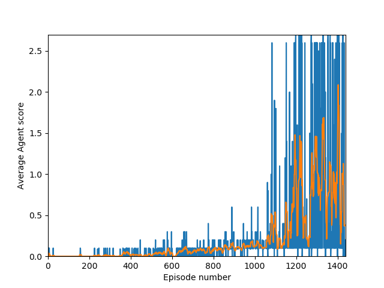

# Collaboration and Competition Report
This is the report for my submission for the Udacity Collaboration and Competition Nanodegree project.
Here I will describe the algorithms and details of how I solved this problem.


## Algorithm
This project implements [Deep Deterministic Policy Gradients](https://spinningup.openai.com/en/latest/algorithms/ddpg.html).
This algorithm uses an actor to learn the action that maximises reward and a critic to train the actor against.
My project also uses a prioritized experience replay

## Details
```python
# hyperparameters
update_every = 1                 # how many episodes to sample before learning
tau = 1e-2                       # soft update factor
experience_buffer_size = 100000  # man number (s, a, r, s, d) samples kept in the replay buffer 
num_epochs = 15                  # how many times to perform learning at any timestep
minibatch_size = 128             # how many data points to sample every epoch
actor_lr = 0.001                 # Adam learning rate of actor
critic_lr = 0.001                # Adam learning rate of critic
action_noise_mean = 0            # The mean of the gaussian noise added to agent actions
action_noise_std = 0.2           # The std of the gaussian noise added to agent actions
gamma = 0.99                     # The discount factor
priority_eps = 0.01              # Additive factor to rewards to ensure non-zero sampling priorities
priority_alpha = 0.5             # Power of rewards when calculating priorities

# Actor
layer1_size = 128
layer2_size = 64
layer3_size = 32

# Critic
layer1_size = 128
layer2_size = 64
layer3_size = 32
```

## Results
My agent was able to solve this environment in 1221 episodes.


## Future work
Here are my ideas on how I could improbe this project going forward:
 - Update priorities after learning for prioritized experience replay
     - Also try use loss for sampling priority rather than reward
 - Try combining actor and critic into same network
 - Noise
     